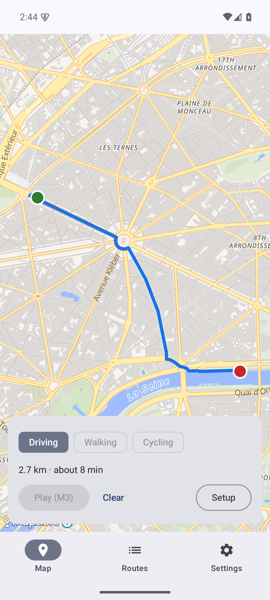
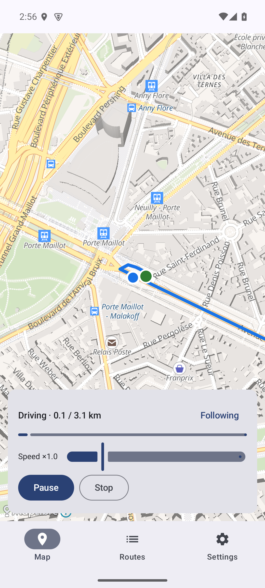
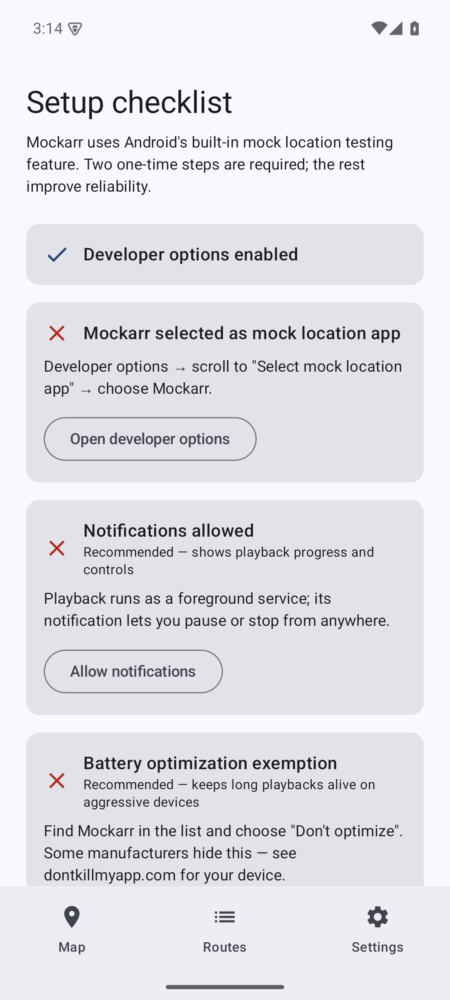
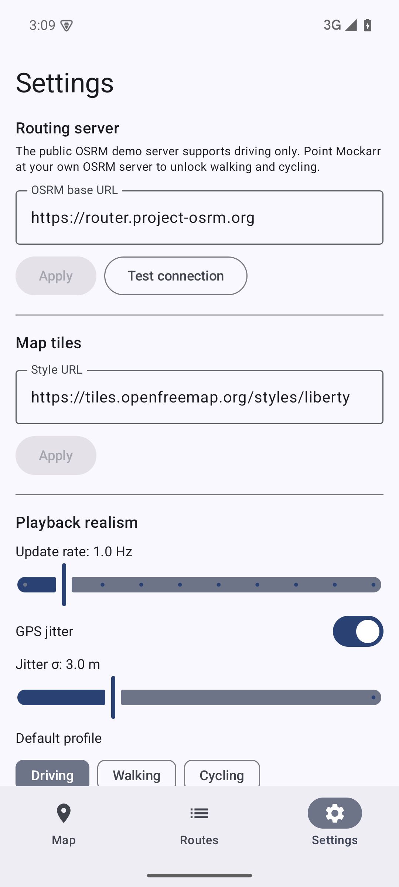

# Mockarr

**Drive a fake route through the real world.** Mockarr is an Android app built on Android's built-in **mock location** developer feature: pick points on a map, generate a realistic road route, press Play — and your device's reported location drives that route with human-like acceleration, corner slow-downs, and GPS-style noise, visible in any app that reads location (including Google Maps).

Built on a fully open stack: **Kotlin · Jetpack Compose · MapLibre · OpenStreetMap · OSRM**. No API keys, no accounts, no tracking.

| Route planning | Playback | Setup checklist | Settings |
|---|---|---|---|
|  |  |  |  |

## Features

- **Road-route playback** — tap two or more points; OSRM finds the road route; the simulation engine drives it with per-segment speeds, kinematic braking before turns, and a graceful stop (never a teleport)
- **Realistic GPS** — Gaussian position jitter, plausible accuracy/speed/bearing on every fix; tune or disable it in Settings
- **Pin mode** — long-press the map to hold your location anywhere
- **Background playback** — foreground service with pause/resume/stop from the notification; survives screen-off
- **Saved routes** — replay past routes fully offline
- **Speed control** — 0.25×–4× live during playback
- **Bring your own server** — point Mockarr at a self-hosted OSRM to unlock walking/cycling profiles, and use any MapLibre style URL for tiles

## How it works

Android's Developer Options include **"Select mock location app"** — an OS-sanctioned testing facility. Once Mockarr is selected there, it registers platform *test providers* (gps, network, fused) via `LocationManager` and feeds them simulated fixes. Google Play services' fused location provider honors these, so consumer apps follow along. Nothing is patched, hooked, or rooted.

> **Fair use**: mock locations exist for app testing. What you do with a mocked location in third-party apps is your responsibility; some services' terms prohibit location spoofing. Mockarr deliberately contains no anti-detection features.

## Install

- **From source** (below) — recommended while the project is pre-release
- F-Droid + GitHub Releases: planned

## Building

Requirements: JDK 17+ and the Android SDK (Android Studio's bundled versions work fine).

```sh
git clone https://github.com/Ethanjopro/Mockarr.git
cd Mockarr
./gradlew build           # compile + unit tests + lint + detekt
./gradlew :app:installDebug   # install on a connected device/emulator
```

First-run setup on the device: enable Developer Options (tap Build number 7×), then Developer Options → **Select mock location app** → Mockarr. The in-app checklist walks you through it.

## Self-hosting OSRM (optional)

The public demo server (`router.project-osrm.org`) is rate-limited and driving-only. To run your own:

```sh
wget https://download.geofabrik.de/europe/monaco-latest.osm.pbf   # pick your region
docker run -t -v $PWD:/data ghcr.io/project-osrm/osrm-backend osrm-extract -p /opt/car.lua /data/monaco-latest.osm.pbf
docker run -t -v $PWD:/data ghcr.io/project-osrm/osrm-backend osrm-partition /data/monaco-latest.osrm
docker run -t -v $PWD:/data ghcr.io/project-osrm/osrm-backend osrm-customize /data/monaco-latest.osrm
docker run -t -i -p 5000:5000 -v $PWD:/data ghcr.io/project-osrm/osrm-backend osrm-routed --algorithm mld /data/monaco-latest.osrm
```

Then set `http://<your-host>:5000` in Mockarr's Settings. Build with `foot.lua`/`bicycle.lua` profiles to unlock walking/cycling.

## Architecture

```
:app                  Compose UI, ViewModels, navigation, PlaybackService, Hilt wiring
:core:model           Shared data types + geo math (pure Kotlin)
:core:simulation      Route playback engine (pure Kotlin, deterministic, fully unit-tested)
:core:routing         RouteProvider abstraction, OSRM client, polyline6 codec, fallback
:core:mocklocation    Mock location providers + setup-status detection
:core:data            Room (saved routes) + DataStore (settings)
```

Key seams are interfaces (`RouteProvider`, `MockLocationController`), so alternative routing backends or mock sinks slot in without touching callers. See [PLAN.md](PLAN.md) for the full design and [PROGRESS.md](PROGRESS.md) for development history.

## Contributing

See [CONTRIBUTING.md](CONTRIBUTING.md). Issues and PRs welcome — especially device-specific reports (mock location behavior varies by OEM).

## Attribution

Map data © [OpenStreetMap](https://www.openstreetmap.org/copyright) contributors · Routing by [OSRM](https://project-osrm.org) · Map rendering by [MapLibre](https://maplibre.org) · Vector tiles by [OpenFreeMap](https://openfreemap.org)

## License

**TBD — all rights reserved until a license is chosen.** Choosing one (leaning GPL-3.0 vs Apache-2.0) is an explicit pre-release task; until then this source is available for reading and building for personal use.
